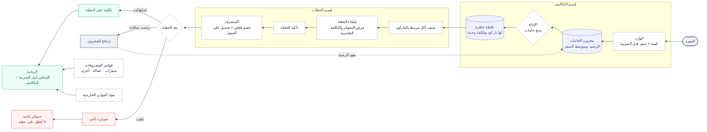
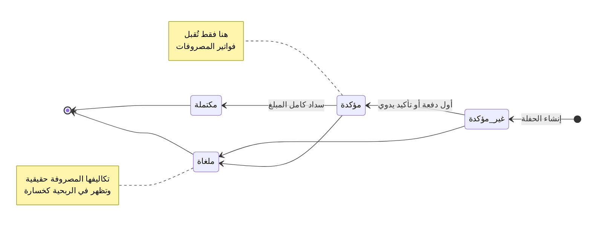
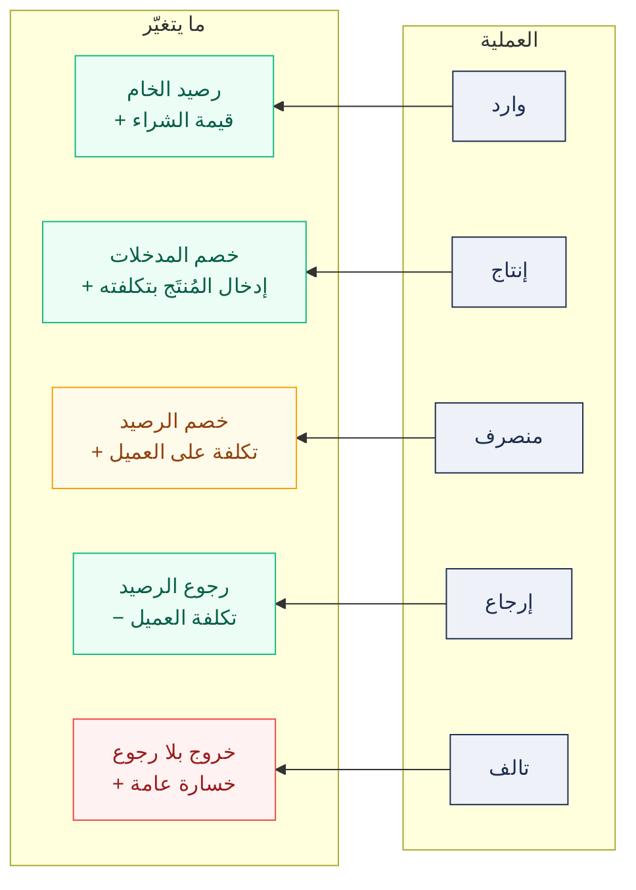
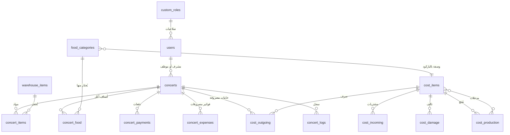
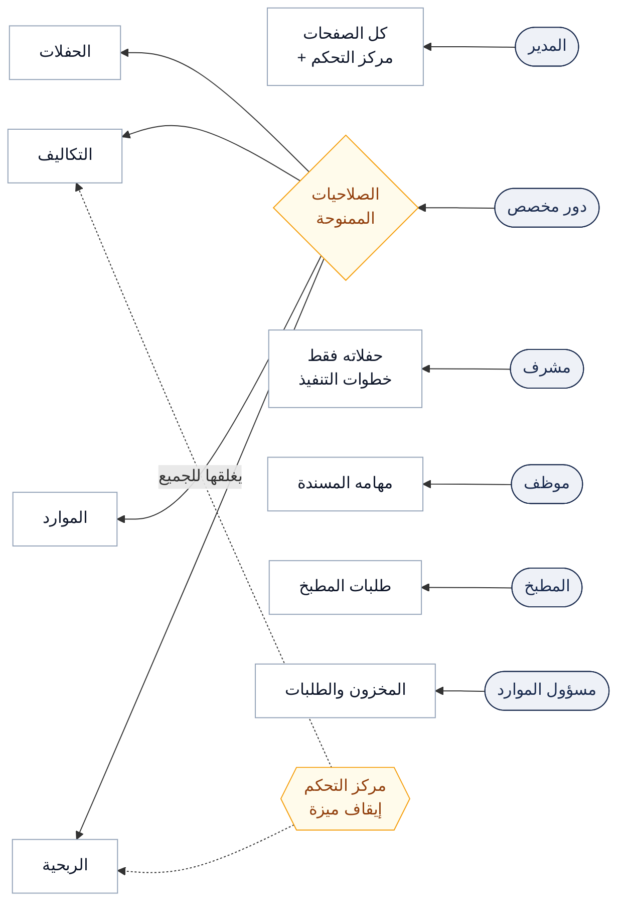

# مخططات نظام الفريج

خمسة مخططات ترسم البرنامج كما يعمل فعلاً. تُقرأ مع [دليل التكاليف](costs-guide.md) و[نظام التصميم](design-system.md).

النسخة التفاعلية منشورة كصفحة مستقلة؛ وهذه النسخة تعيش مع الكود فتتغيّر معه.

---

## 1. المسار الكامل — من الشراء إلى الربح

السلسلة التي يقوم عليها البرنامج. كل سهم عملية يسجّلها مستخدم، وكل صندوق حالة تُحفظ في قاعدة البيانات.

> ⚠️ **إنشاء الحفلة لا يخصم شيئاً.** عرض المتوفر والتكلفة التقديرية قراءة فقط؛ المخزون لا ينزل إلا بتسجيل **منصرف** فعلي.

---

## 2. دورة حياة الحفلة

أربع حالات لا غير، ومصدرها الوحيد `lib/concert-status.ts`. مراحل التشغيل الخمس تُشتقّ من علامات محفوظة ولا تُعدّ حالات مستقلة.

---

## 3. أين يُخصم المخزون وأين تُحمَّل التكلفة

كل عملية وما تكتبه بالضبط. وكل ما يمسّ المخزون يجري في معاملة واحدة — تنجح كاملة أو لا تجري.

| العملية | الرصيد | تكلفة الحفلة | عكسها |
|---|---|---|---|
| وارد | يرتفع | — | الحذف يخصم الكمية والقيمة |
| إنتاج | مدخلات ↓ · مُنتَج ↑ | — | الحذف يعكس الطرفين |
| منصرف على حفلة | ينخفض | ترتفع | الحذف يعيد ما بقي خارجاً فقط |
| إرجاع (تسوية) | يرتفع | تنخفض | جزئي وعلى دفعات |
| تالف | لا يعود | تنخفض | يُقيَّد خسارة عامة |

---

## 4. بنية البيانات

مجموعات Firestore والعلاقة بينها. الحقول المشتقّة (المدفوع، تكلفة المواد، المصروفات) لا تُكتب يدوياً بل تُعاد من مصدرها بعد كل تغيير.

> 🔗 الربط بين الأكل والتكاليف **بالباركود لا بالاسم** — نفس الاسم قد يكون خلطتين مختلفتين في قسمين بتكلفتين مختلفتين.

---

## 5. الأدوار ومن يرى ماذا

طبقتان تحكمان الوصول: **الصلاحية** تحجب عن شخص، و**إيقاف الميزة** من مركز التحكم يغلقها على الجميع.

